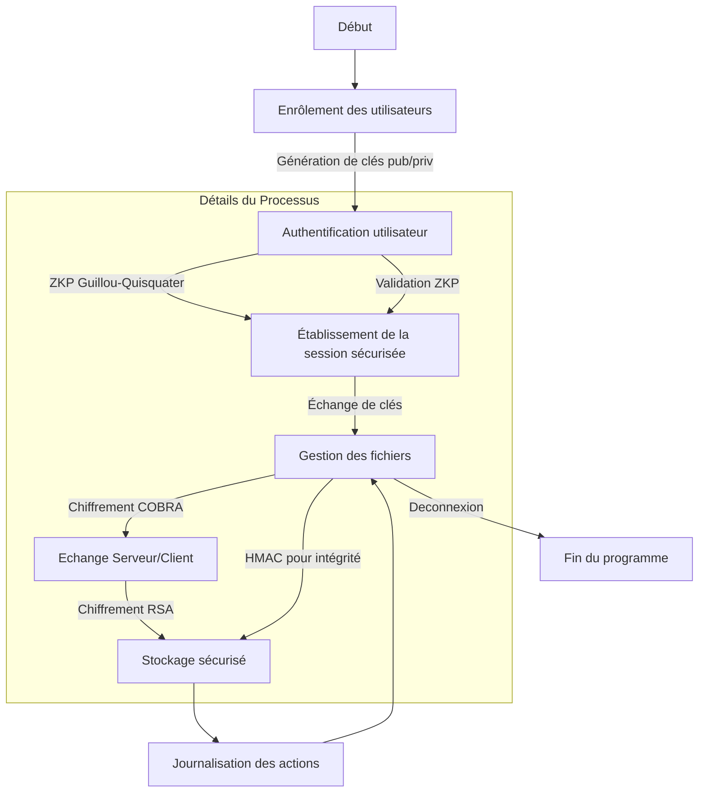

# GS15_Coffre_sa_maman A24

# GS15_Coffre_sa_maman A24

Ce projet implémente un coffre-fort numérique en Python pour le stockage sécurisé de données sensibles. Il est développé dans le cadre du cours GS15 en cryptologie, avec des exigences strictes en matière de sécurité.

## Fonctionnalités Principales

-  **Chiffrement et Déchiffrement** :
   -  RSA (asymétrique) et COBRA (symétrique).
-  **Authentification Sécurisée** :
   -  Preuve à divulgation nulle via le protocole Guillou-Quisquater.
-  **Échange de Clés** :
   -  Sécurisation des sessions avec Diffie-Hellman.
-  **Traçabilité** :
   -  Journalisation des actions des utilisateurs.

## Algorithmes Implémentés

1. **RSA (Rivest-Shamir-Adleman)** :

   -  Gestion des clés via une fonction éponge personnalisée.
   -  Gestion de blocs pour les fichiers volumineux.

2. **COBRA** :

   -  Inspiré de l'algorithme SERPENT, avec des améliorations pour la substitution et la diffusion.

3. **ZKP Guillou-Quisquater** :

   -  Protocole de preuve à divulgation nulle intégré pour l’authentification.

4. **Diffie-Hellman** :

   -  Partage sécurisé de clés sur des canaux non sécurisés.

5. **HMAC** :
   -  Vérification de l'intégrité des données échangées.

## Défis et Solutions

-  **Limitation des blocs RSA** :
   -  Utilisation de `libnum` pour segmenter et réassembler les données.
-  **Validation des Protocoles ZKP** :
   -  Tests unitaires exhaustifs pour garantir l’intégrité des calculs modulaires.
-  **Gestion des Blocs Non Alignés (COBRA)** :
   -  Implémentation d’un mécanisme de padding codé en longueur.

## Architecture Générale

1. **Enrôlement des Utilisateurs** :
   -  Création de répertoires utilisateurs et génération de clés RSA.
2. **Chiffrement des Fichiers** :
   -  RSA pour les petites données, COBRA pour les fichiers volumineux.
3. **Authentification** :
   -  Validation de l'identité utilisateur via ZKP.
4. **Échange de Clés** :
   -  Utilisation de Diffie-Hellman pour sécuriser les communications.

### Processus d'Utilisation

Le processus complet de l'utilisation du coffre-fort comprend plusieurs étapes pour garantir la sécurité et la confidentialité des données. Voici un schéma du flux d’utilisation :

```plaintext
Utilisateur                                         Coffre-Fort / Serveur
   │                                                        │
   │                       **1. Enrôlement**                │
   │───────────────────────────────────────────────────────>│
   │  - L'utilisateur crée un compte                        │
   │  - Un répertoire est créé pour l'utilisateur           │
   │  - Génération d'une paire de clés (publique/privée)    │
   │  - La clé publique est stockée en clair               │
   │<───────────────────────────────────────────────────────│

   │                       **2. Dérivation de la Clé (KDF)** │
   │───────────────────────────────────────────────────────>│
   │  - L'utilisateur entre un mot de passe                 │
   │  - Le mot de passe est transformé en clé privée        │
   │    via une fonction de dérivation (KDF)                │
   │  - Le sel est généré pour sécuriser la clé privée      │
   │  - La clé privée dérivée et le sel sont stockés        │
   │<───────────────────────────────────────────────────────│

   │                **3. Authentification à Double Sens**   │
   │───────────────────────────────────────────────────────>│
   │  - Demande de certificat au coffre-fort                │
   │  - Vérification par une Autorité de Certification      │
   │<───────────────────────────────────────────────────────│
   │───────────────────────────────────────────────────────>│
   │  - L'utilisateur s'authentifie au coffre-fort          │
   │  - Preuve de possession de la clé privée               │
   │    via une preuve à divulgation nulle (ZKP)            │
   │<───────────────────────────────────────────────────────│

   │                    **4. Échange de Clés**              │
   │───────────────────────────────────────────────────────>│
   │  - L'utilisateur et le serveur échangent une           │
   │    clé de session en utilisant Diffie-Hellman          │
   │  - La clé de session sécurise les échanges             │
   │<───────────────────────────────────────────────────────│

   │         **5. Dépôt / Consultation de Fichiers**        │
   │───────────────────────────────────────────────────────>│
   │  - Dépôt ou consultation de fichiers                   │
   │  - Les fichiers sont chiffrés avec l'algorithme COBRA  │
   │    (chiffrement symétrique)                            │
   │  - Utilisation d'un hash MAC pour vérifier l'intégrité │
   │  - Les fichiers sont chiffrés pour stockage avec       │
   │    la clé publique de l'utilisateur (chiffrement RSA)  │
   │<───────────────────────────────────────────────────────│
```

# Processus d'Utilisation du Coffre-Fort Numérique



subgraph Détails du Processus
Authentification -->|Validation ZKP| Session
Chiffrement -->|HMAC pour intégrité| Stockage
Echange
end

```

```
